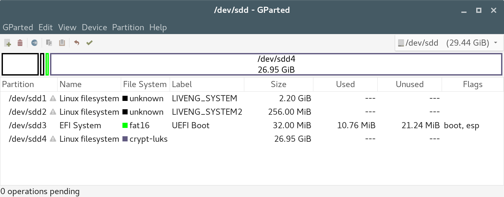

Persistence
===========

Once `setup <secure-boot.html>`_ a USB key with a GPT and protective MBR partitioning scheme, with three partitions, two for the system (kernel, initrd, filesystem.squashfs and kernel, initrd respectively) and one for the UEFI/UEFI Secure Boot compliance with the use of GRUB, we will now make it data-persistent capable.

Data persistence is accomplished by a fourth partition on the USB key where system is instructed to write into, or better explained, which the system will union-mount with the filesystem.squashfs image.

Kernel boot parameter *persistence* tells the live-boot modified initrd's /lib/live/* scripts to search (by default) for a device partition named *persistence* and with a config file inside, named *persistence.conf*. You can see /lib/live/* scripts' content by decompressing an initrd image (it's a cpio compressed image).

Because we already put the *persistence* parameter witin the list of the kernel boot parameters::

    linux /live/vmlinuz initrd=/live/initrd.img fromiso=2018-10-01-10-22-29-00 boot=live live-noconfig **persistence**

we now just need to create a fourth partition on the USB key (as big as the space left on the key), labelled *persistence*::

    printf "n\n\n\n\n\nw\nY\n" | gdisk ${device} && sync
    mkfs.ext4 -F -L "persistence" ${device}4
   
and to add the *persistence.conf* file inside::

    mount ${device}4 /mnt
    echo "/ union" > /mnt/persistence.conf
    umount /mnt

With ``/ union`` we instruct the initrd to union-mount this partition for the whole filesystem.

    Encrypted persistence for a liveng system with a stock Debian live image as the base is not as straightforward as you might think and requires a lot of work. However, a persistent liveng operating system without encryption is as well suitable for demonstrating the kernel update on a ISO9660 filesystem, which after all is the most important liveng feature. So, if primarily interested in the kernel update, you can skip the next sections of this chapter.

Encrypted persistence
^^^^^^^^^^^^^^^^^^^^^

Kernel boot parameter *persistence-encryption=luks* tells the initrd to search for a LUKS-encrypted device partition named *persistence* for the union-mount. The initrd's /lib/live/* scripts will ask a user for the decryption password during the boot and will decrypt the partition with `cryptsetup <https://gitlab.com/cryptsetup/cryptsetup/>`_.

First of all, we have to add the parameter to the list of kernel boot parameters in the grub.cfg's::

    mount ${device}3 /mnt/  

        cat > /mnt/efi/boot/grub.cfg <<EOF
    menuentry 'liveng standard boot' --unrestricted {         
        insmod iso9660
        search --no-floppy --set=root --hint-efi=hd0,gpt2 --fs-uuid $(blkid -s UUID ${device}2 | awk -F\" '{print $2}')
        linux /live/vmlinuz initrd=/live/initrd.img fromiso=$(blkid -s UUID ${device}1 | awk -F\" '{print $2}') boot=live live-noconfig persistence persistence-encryption=luks
        initrd /live/initrd.img
    }
    EOF

        cat >> /mnt/efi/boot/grub.cfg <<EOF
    menuentry 'liveng fallback boot' --unrestricted {         
        insmod iso9660
        search --no-floppy --set=root --hint-efi=hd0,gpt1 --fs-uuid $(blkid -s UUID ${device}1 | awk -F\" '{print $2}')
        linux /live/vmlinuz initrd=/live/initrd.img fromiso=$(blkid -s UUID ${device}1 | awk -F\" '{print $2}') boot=live live-noconfig persistence persistence-encryption=luks liveng-fallback
        initrd /live/initrd.img
    }
    EOF

        cat > /mnt/boot/grub/grub.cfg <<EOF
    menuentry 'liveng standard boot' --unrestricted {         
        insmod iso9660
        search --no-floppy --set=root --hint-efi=hd0,gpt2 --fs-uuid $(blkid -s UUID ${device}2 | awk -F\" '{print $2}')
        linux /live/vmlinuz initrd=/live/initrd.img fromiso=$(blkid -s UUID ${device}1 | awk -F\" '{print $2}') boot=live live-noconfig persistence persistence-encryption=luks
        initrd /live/initrd.img
    }
    EOF

        cat >> /mnt/boot/grub/grub.cfg <<EOF
    menuentry 'liveng fallback boot' --unrestricted {         
        insmod iso9660
        search --no-floppy --set=root --hint-efi=hd0,gpt1 --fs-uuid $(blkid -s UUID ${device}1 | awk -F\" '{print $2}')
        linux /live/vmlinuz initrd=/live/initrd.img fromiso=$(blkid -s UUID ${device}1 | awk -F\" '{print $2}') boot=live live-noconfig persistence persistence-encryption=luks liveng-fallback
        initrd /live/initrd.img
    }
    EOF

    umount /mnt

Then we must initialize the fourth partition as a LUKS one, format and label it (of course, we are overwriting what we've just done the step before)::

    # Recreate partition.
    printf "d\n4\nw\nY\n" | gdisk ${device} && sync
    printf "n\n\n\n\n\nw\nY\n" | gdisk ${device} && sync
    mkfs.ext4 -F -L "persistence" ${device}4

    # Initialize a LUKS ext4 partition.
    echo -n "PASSWORD" | cryptsetup --hash=sha512 --cipher=aes-xts-plain64 --key-size=512 luksFormat ${device}4 -
    echo -n "PASSWORD" | cryptsetup luksOpen ${device}4 encrypted -

    mkfs.ext4 /dev/mapper/encrypted && sync
    e2label /dev/mapper/encrypted persistence && sync

    /sbin/cryptsetup luksClose /dev/mapper/encrypted

Previous lines initialize a LUKS partition with a random master key and with *PASSWORD* as the first-slot password which encrypts the master key.

Finally, we must put the *persistence.conf* file inside it::

     echo -n "PASSWORD" | cryptsetup luksOpen ${device}4 encrypted -
     mount -t auto /dev/mapper/encrypted /mnt

     echo "/ union" > /mnt/persistence.conf
    
     umount /mnt 
     cryptsetup luksClose /dev/mapper/encrypted  

liveng should now be persistent, but unfortunately **the stock Debian live initrd image misses cryptsetup binaries and libraries** (bacause it is not *live-built* for this purpose). By opening the cpio archive you can notice that a lot of the following needed files are missing::

    ./lib/x86_64-linux-gnu/libcryptsetup.so.4.7.0
    ./lib/x86_64-linux-gnu/libgcrypt.so.20.1.6
    ./lib/x86_64-linux-gnu/libcryptsetup.so.4
    ./lib/x86_64-linux-gnu/libgcrypt.so.20
    ./lib/cryptsetup
    ./lib/modules/4.9.0-7-amd64/kernel/crypto
    ./lib/modules/4.9.0-7-amd64/kernel/crypto/cryptd.ko
    ./lib/modules/4.9.0-7-amd64/kernel/fs/crypto
    ./lib/modules/4.9.0-7-amd64/kernel/fs/crypto/fscrypto.ko
    ./lib/modules/4.9.0-7-amd64/kernel/arch/x86/crypto
    ./lib/modules/4.9.0-7-amd64/kernel/drivers/crypto
    ./lib/modules/4.9.0-7-amd64/kernel/drivers/md/dm-crypt.ko
    ./sbin/cryptsetup

Example is at the time of writing, late 2018.

We have to add them: fasten your seat belts. 
Please note that the following steps must be done because the stock Debian live images lack cryptsetup presence into the initrd; the steps below are described for completeness: starting from a Debian-derivative live image which already has cryptsetup built in the initrd will simplify the liveng transoformation.

Adding cryptsetup to liveng: create a modified initrd
^^^^^^^^^^^^^^^^^^^^^^^^^^^^^^^^^^^^^^^^^^^^^^^^^^^^^

Fastest way to add those files into the initrd image of our liveng is to boot and run the liveng with cleartext persistence we obtained the step before *"Encrypted persistence"*, and launch an initrd update after having installed cryptsetup into the system and having enabled the ad-hoc initramfs-hook.

So, boot the liveng image, get a terminal emulator as root and install cryptsetup:

    apt-get install cryptsetup

then modify */etc/cryptsetup-initramfs/conf-hook* in order to enable the initramfs hook (it will instruct initramfs-tools what to do when updating the initrd)::

    sed -i 's/#CRYPTSETUP=/CRYPTSETUP=y/g' /etc/cryptsetup-initramfs/conf-hook

then manually trigger the initrd update (update is by default disabled, being liveng a live operating system with a ISO filesystem)::

   mkinitramfs -o $(ls /boot | grep initrd)

Finally copy the *initrd.img-** from the current directory to an external USB key, power off the computer and go back to the host system where forging liveng.

    Note: when modifying the initrd image, we must also modify the filesystem.squashfs content adding the cryptsetup binary and, most important, enabling the initramfs hook in */etc/cryptsetup-initramfs/conf-hook*, in order to keep the cryptsetup binaries in the initrd on future kernel updates. This step is not covered here. 

Replacing stock image's initrd
^^^^^^^^^^^^^^^^^^^^^^^^^^^^^^

We now need to replace the initrd into the original Debian live image with the new one: we will accomplish this task with the use of xorriso in three discrete steps.

Remove ye old initrd.img-version from the stock Debian live image and save a temporary image as the result::

    xorriso -indev ${imageFile} -boot_image any discard -overwrite on -volid LIVENG_SYSTEM -rm_r live/initrd.img-4.9.0-7-amd64 -- -outdev ${imageFile}1 -blank as_needed

Add the initrd.img-version previously built::

    xorriso -indev ${imageFile}1 -boot_image any discard -overwrite on -volid LIVENG_SYSTEM -add initrd.img-4.9.0-7-amd64 -- -outdev ${imageFile}2 -blank as_needed  

Move it into the internel *live/* folder::

    xorriso -indev ${imageFile}2 -boot_image any discard -overwrite on -volid LIVENG_SYSTEM -move initrd.img-4.9.0-7-amd64 live/initrd.img-4.9.0-7-amd64 -- -outdev ${imageFile}3 -blank as_needed

We finally obtain an image identical to the original Debian live, but with an initrd capable of doing cryptsetup::

    imageFile=${imageFile}3

If we repeat all the liveng steps, starting from the beginning, with this image as the base, we get an encrypted persisten live as a result!

Conclusion
^^^^^^^^^^

liveng is now Secure Boot capable and persistent, with the data partition encrypted with the passphrase of your choice (here *PASSWORD*). 
When you will choose another passphrase, just keep in mind that the keymap used during the system booting is en_US.

